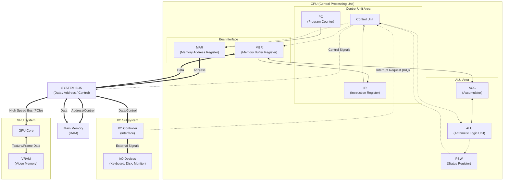

# 1. 폰 노이만 구조

초기 컴퓨터는 새로운 계산을 하려면 전선을 재배치하고 스위치를 조작하여 하드웨어를 변경해야 했다.  
그래서 폰 노이만이 프로그램 내장 방식(Stored Program Concept)을 제안했고, 이것이 현대 컴퓨터의 구조가 되었다.  

- 컴퓨터에서 다른 작업을 진행할 때 하드웨어의 재배치 없이 소프트웨어만 변경하면 된다. (범용성 향상)
- 컴퓨터는 CPU, 메모리, 버스, 입출력 장치로 구성된다.
- 명령어(Instruction)와 데이터(Data)가 같은 메모리 공간에 저장되며, 같은 버스를 통해 CPU로 전달된다.
- fetch -> decode -> excute -> store 사이클로 명령어를 처리한다.

## 1.1. 폰 노이만 구조 단점
프로그램 메모리와 데이터 메모리가 하나의 버스를 공유하기 때문에 병목 현상(bottleneck)이 발생한다.  
즉, CPU가 아무리 빨라도 메모리에서 데이터를 가져오는 속도(전송 속도)가 느리면 전체 시스템 성능이 저하되는 것이다.  
(기억장치의 속도가 전체 시스템의 속도를 결정)

---

# 2. 메모리 계층 구조

Memory Hierachy는 컴퓨터의 모든 부품을 빠르고 저장 용량이 큰 하드웨어로 setting하면 좋겠지만, 용량, 접근 속도, 비용간의 절충 관계를 파악해 필요에 따라 채택할 수 있게 나타낸 구조이다.  

이미지를 확인해보면 위로 올라갈수록 bit당 cost가 높아지고, 내려갈수록 용량과 접근 시간이 늘어난다.  

## 2.1. Register
CPU 안에 있는 작은 메모리로 속도가 가장 빠르지만, 기억 용량이 적고 휘발성이다.  
ex) PC, IR, MAR...etc

## 2.2. Cache Memory
CPU와 Main Memory 사이에 존재하며, L1, L2, L3 cache가 존재한다.
(휘발성)

- L1 Cache: CPU core 내부에 존재하며, 가장 빠른 캐시이다.
- L2 Cache: CPU 코어 내부/인접하게 존재한다.
- L3 Cache: CPU 내부에 존재하며, 멀티 코어 CPU에서 여러 코어가 공유하는 캐시이다.

### 2.2.3. Locality
캐시는 Locality(지역성)라는 성질을 사용해 동작한다.  

- Temporal Locality(시간 지역성): 한 번 참조된 데이터는 조만간 다시 참조될 가능성이 높다.
- Spatial Locality(공간 지역성): 참조된 데이터의 주변 데이터가 조만간 참조될 가능성이 높다.

이런 지역성을 사용해 캐시에 data를 담아두는 것이다.

### 2.2.3. Cache Hit / Miss

CPU에서 요청한 data가 Main Memory까지 가서 찾아오지 않고, 캐시에서 찾아오는 것을 **Cache Hit**라고 하고,  
만약 요청한 data가 캐시에 존재하지 않다면, **Cache Miss**라고 한다.

위 이미지를 확인해보면 캐시 미스가 발생해서 Main Memory까지 다녀오면 Access Time이 10배나 늘어날 수 있다. (25ns -> 250ns)  

그래서 코드를 작성할 때 캐시 친화적으로 작성해야하는 것이다.  
(자세한 블로그 https://velog.io/@piopiop/%ED%96%89%EB%A0%AC%EA%B3%B1%EC%85%88-%EC%B5%9C%EC%A0%81%ED%99%94-%EA%B3%B5%EA%B0%84-%EC%A7%80%EC%97%AD%EC%84%B1%EC%9D%84-%ED%99%9C%EC%9A%A9%ED%95%9C-%EC%BA%90%EC%8B%9C-%EC%B9%9C%ED%99%94%EC%A0%81-%EC%BD%94%EB%93%9C-%EC%9E%91%EC%84%B1)

## 2.3. Main Memory
CPU가 직접 접근할 수 있는 메모리로, 현재 실행 중인 프로그램(Process)과 데이터가 저장되는 공간이다.
(휘발성)

- RAM (Random Access Memory): 어느 위치에 저장된 데이터든 접근하는 데 걸리는 시간이 동일하다.
- DRAM: 주로 주기억장치로 쓰이며, 비용이 저렴하고 용량이 크다. (캐시는 주로 속도가 빠른 SRAM 사용)

## 2.4. Secondary Storage 
Main Memory는 비싸고 휘발성이기 때문에, 데이터를 영구적으로 보관하고 대용량으로 저장하기 위해 사용한다. (비휘발성)  
CPU가 직접 접근할 수 없으며, 데이터를 Main Memory로 옮긴 후 처리해야 한다.

### 2.4.1. HDD (Hard Disk Drive)
- 방식: 자성 물질이 코팅된 원판(플래터)을 고속으로 회전시키며 헤드(바늘)로 데이터를 읽고 쓴다.
- 특징: 물리적으로 회전하기 때문에 소음과 진동이 있고, 충격에 약하다.
- 속도: 탐색 시간(Seek Time)과 회전 지연(Rotational Latency)이 발생하여 SSD보다 느리다.

### 2.4.2. SSD (Solid State Drive)
- 방식: 반도체(Flash Memory)를 이용하여 데이터를 전기적으로 저장한다.
- 특징: 물리적으로 움직이는 부품이 없어 소음이 없고, 충격에 강하다.
- 속도: HDD보다 데이터 입출력 속도가 훨씬 빠르며, 부팅 속도나 로딩 속도 향상에 큰 영향을 준다.

## 2.5. I/O Devices
컴퓨터 외부와 데이터를 교환하기 위한 장치들이다. 컴퓨터 내부(CPU/Memory) 속도에 비해 매우 느리다.

- 입력 장치 (Input): 데이터를 컴퓨터 내부로 넣어주는 장치 (키보드, 마우스, 마이크 등)
- 출력 장치 (Output): 컴퓨터 내부의 처리 결과를 사용자에게 보여주거나 들려주는 장치 (모니터, 스피커, 프린터 등)
- I/O Controller: CPU와 I/O 장치 사이의 속도 차이와 통신 규격을 맞춰주는 중개자 역할을 한다.

### 2.5.1. Device Driver
I/O 장치를 물리적으로 연결하더라도, 운영체제(OS)가 이 장치를 어떻게 제어해야 할지 모르면 사용할 수 없다. 이때 필요한 것이 장치 드라이버이다.  
OS 커널이 모든 장비의 제어 코드를 내장할 수 없으므로, 하드웨어 제조사에서 제공하는 드라이버를 통해 제어한다.

- Ex:
  - 그래픽 드라이버: Intel UHD Graphics Driver, NVIDIA GeForce Driver (설치하지 않으면 화면 해상도가 깨지거나 게임 성능이 안 나옴)
  - 네트워크 드라이버: Realtek PCIe GbE Family Controller (설치하지 않으면 인터넷 연결 불가)

# 3. CPU 구조

CPU는 Main Memory에서 명령어를 읽어들이고 이를 수행하는 역할을 하고 그 구성 요소는 아래와 같다.  

- **ALU:** 산술 연산(사칙 연산)과 논리 연산(AND, OR...etc)을 담당한다.
- **CU:** 명령어를 해석하고 명령어에 따른 제어 신호를 생성하여, 각 장치에 Control Signal을 보낸다.
- **Register:** CPU 내부의 초고속 임시 저장 장치로 크게 특수 목적 레지스터와 범용 레지스터로 분리된다.
  - **Special Purpose:**
    - PC: 다음 실행할 명령어의 주소
    - IR: 현재 실행중이 명령어
    - MAR / MBR: 메모리 주소 / 메로리 상태 버퍼
    - PSW: 상태 레지스터(Flag)
  - **General Purpose:**
    - data Register
    - Pointer / Index Register

## 3.1. CPU 동작 방식

CPU는 위 프로세스로 명령어를 실행한다.

1. 인출 (Fetch): PC(프로그램 카운터)가 가리키는 주소의 명령어를 메모리에서 가져와 IR(명령어 레지스터)에 저장

2. 해석 (Decode): 가져온 명령어가 어떤 동작을 하는지 제어장치가 해석하고, 필요한 피연산자(데이터)를 가져옴

3. 실행 (Execute): ALU(산술논리연산장치)를 통해 실제 연산을 수행하거나 데이터를 이동

4. 저장 (Write Back): 연산 결과를 레지스터나 메모리에 반영

## 3.2. 명령어 처리 방식

CPU는 기본적으로 3.1.의 프로세스로 진행하지만, CPU의 구조(아키텍처, ISA 등)와 설계 방식에 따라 각 단계가 수행되는 구체적인 방식이나 효율성에는 차이가 있다.

| 구분 | CISC (Complex ISA) | RISC (Reduced ISA) |
|:-:|:-:|:-:|
설계 철학 |	복잡한 명령어 하나로 많은 일을 하자	| 간단한 명령어를 조합해서 빠르게 처리하자
명령어 길이 |	가변적 (Variable) |	고정적 (Fixed) - 파이프라이닝 유리
하드웨어 |	복잡함 (마이크로 코드 사용) |	단순함 (하드와이어드 제어)
대표 예시 |	Intel x86 (PC, Server) |	ARM (Mobile, M1/M2/M3), MIPS

## 3.3. 명령어 파이프 라인

## 3.4. Pipeline Hazard
CPU 성능을 높이기 위해 여러 명령어를 겹쳐서 실행하는 파이프라이닝 기술 사용 시 발생할 수 있는 문제점들로 구조적, 데이터, 제어 위험이 존재한다.

### 구조적 해저드 (Structural Hazard)
- 서로 다른 명령어가 같은 하드웨어 자원(예: 메모리)을 동시에 쓰려 할 때 발생.
- 해결: 자원 복제 (L1 캐시를 명령어/데이터 캐시로 분리).

### 데이터 해저드 (Data Hazard)
- 앞 명령어의 실행 결과가 아직 안 나왔는데, 뒤 명령어가 그 데이터를 필요로 할 때 발생 (의존성).
- 해결: 전방 전달(Forwarding), 스톨(Stall).

### 제어 해저드 (Control Hazard)
- if문이나 jump 분기 명령어로 인해 다음에 실행할 명령어가 바뀔 수 있어, 미리 채워둔 파이프라인을 비워야 할 때 발생.
- 해결: 분기 예측(Branch Prediction).

---

# 참고자료

## 폰노이만 구조
https://jiwondev.tistory.com/109  
https://wikidocs.net/63816  
https://m.blog.naver.com/with_msip/221981730449  

## 메모리 계층 구조
https://www.geeksforgeeks.org/computer-organization-architecture/memory-hierarchy-design-and-its-characteristics/  
https://nayoungs.tistory.com/entry/%EC%9A%B4%EC%98%81%EC%B2%B4%EC%A0%9C-%EB%A9%94%EB%AA%A8%EB%A6%AC-%EA%B3%84%EC%B8%B5-%EA%B5%AC%EC%A1%B0Memory-Hierachy

## CPU 구조
https://maloveforme.tistory.com/152  
https://seunghyeokleedev.tistory.com/12
